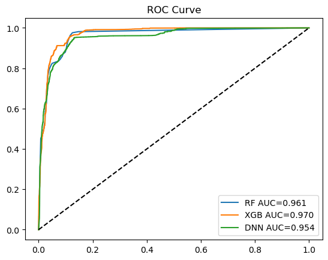
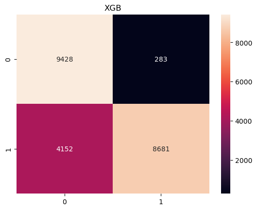
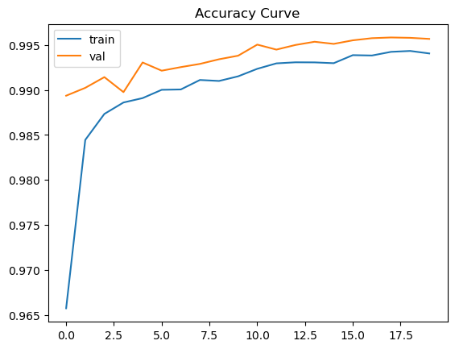
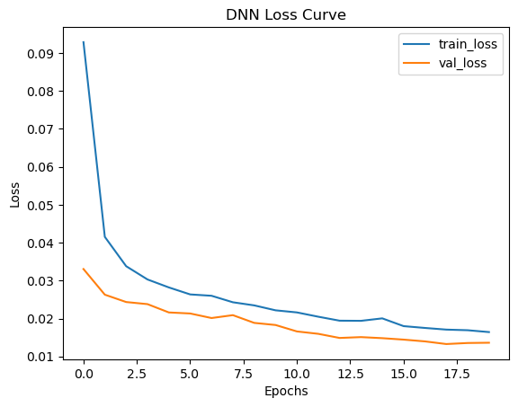

# 🛡️ Machine Learning-Based Network Intrusion Detection System (NIDS)

## 📌 Project Overview

This project implements a **Machine Learning-based Network Intrusion Detection System (NIDS)** using the **NSL-KDD dataset**.

The goal is to detect whether a network connection is **normal or an attack** by comparing multiple Machine Learning and Deep Learning models.

---

## 🎯 Objectives

* Build and evaluate multiple models for intrusion detection
* Compare performance using standard metrics
* Analyze computational complexity
* Identify the best model for real-world deployment

---

## 📂 Dataset

* **NSL-KDD Dataset**
* Contains labeled network traffic data
* Binary classification:

  * `0 → Normal`
  * `1 → Attack`

---

## ⚙️ Models Implemented

### 🔹 Classical Machine Learning

* Random Forest (RF)

### 🔹 Advanced Machine Learning

* XGBoost (XGB)

### 🔹 Deep Learning

* Deep Neural Network (DNN)

---

## 🧠 Methodology

### 1. Data Preprocessing

* Handling categorical features using Label Encoding
* Feature scaling using StandardScaler (for DNN)
* Binary label conversion (normal vs attack)

### 2. Model Training

* All models trained on the same dataset
* Fair comparison ensured

### 3. Evaluation Metrics

* Accuracy
* Precision, Recall, F1-score
* ROC Curve
* AUC Score
* Confusion Matrix

### 4. Additional Analysis

* Training vs Validation curves (DNN)
* Overfitting / Underfitting analysis
* Model complexity comparison

---

## 📊 Results

| Model         | Accuracy  | AUC       | Parameters | Train Time (s) | Inference Time (s) |
| ------------- | --------- | --------- | ---------- | -------------- | ------------------ |
| Random Forest | 0.774     | 0.962     | 100,814    | 5.64           | 0.13               |
| XGBoost ⭐     | **0.803** | **0.970** | **200**    | **2.33**       | **0.04**           |
| DNN           | 0.772     | 0.949     | 16,513     | 43.64          | 1.30               |

---

## 📈 Key Findings

* **XGBoost achieved the best performance** with the highest accuracy and AUC score.
* It also showed **lowest computational cost** and fastest inference time.
* Random Forest performed well but required significantly more parameters.
* DNN showed comparatively lower performance and higher training time.

---

## 🏆 Best Model

👉 **XGBoost is selected as the optimal model**

### Reasons:

* Highest Accuracy (80.3%)
* Highest AUC Score (0.97)
* Fastest Training & Inference
* Lowest Model Complexity

---

## ⚖️ Complexity Analysis

* **Random Forest**: High complexity due to large number of trees
* **XGBoost**: Efficient and optimized boosting algorithm
* **DNN**: High training cost and slower inference

---

## 📊 Visualizations

The project includes:

* ROC Curves for all models
* Confusion Matrices
* Training vs Validation plots (DNN)
* Loss Curve

### 🔹 ROC Curve Comparison


### 🔹 Confusion Matrix (XGBoost)


### 🔹 Training vs Validation Curve (DNN)


### 🔹 Training vs Validation Curve (DNN)


---

## 🚀 How to Run

### 1. Clone the Repository

```bash
git clone https://github.com/your-username/nids-ml-project.git
cd nids-ml-project
```

### 2. Install Dependencies

```bash
pip install -r requirements.txt
```

### 3. Run Jupyter Notebook

```bash
jupyter notebook
```

Open the notebook and run all cells.

---

## 📁 Project Structure

```
├── data/
│   ├── KDDTrain+.txt
│   ├── KDDTest+.txt
├── notebook/
│   └── nids_model.ipynb
├── README.md
└── requirements.txt
```

---

## 🔥 Future Work

* Multi-class classification (DoS, Probe, R2L, U2R)
* Feature selection techniques
* Hyperparameter tuning
* Ensemble learning methods
* Real-time intrusion detection system

---

## 👨‍💻 Author

**Badar uddin Noman**
Student, Electronics & Telecommunication Engineering
Chittagong University of Engineering & Technology

---

## 📜 License

This project is for academic and research purposes.
